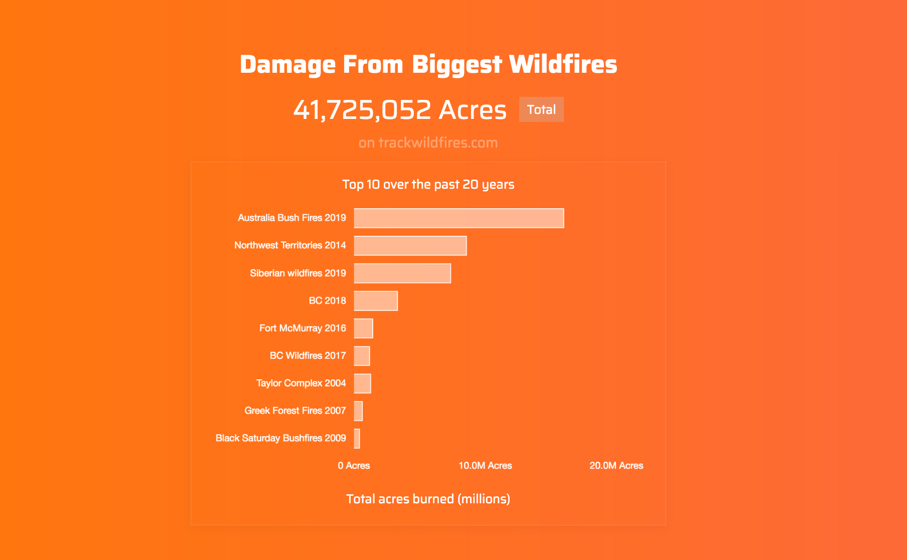

<div align="center">
  <h1>TrackWildfires.com</h1>
  <p>Track Wildfires is a fullstack app built with React, Redux, Node, Saas, Reddit API, Youtube API, and Jest</p>
  
  <br />
</div>
<br>

View the [web app](https://trackwildfires.com)

## Contents

- [Overview](#overview)
- [Getting Started](#getting-started)
- [Tests](#tests)

## Overview
An open source database and visualization tool for the biggest wildfires over the past 20 years

## Getting Started
Use Node v12 to install and run the app 

```
npm install
npm run dev
```

Export the static production build and upload it to your static host (netlify, cloudflare, s3)
```
npm run deploy
```

#### Eslint
Track Wildfires uses the airbnb react linter, which runs on npm run dev.

## Tests
Track Wildfires uses Jest and React-Testing-Library to test redux connected components. Tests can be found inside the components folder, eg body.test.js. Redux data is imported from __mocks__ as a static state. Whenever the app's state is changed, it will also need to seperately be updated here.

#### Run the test watcher  
```
npm run test
```
